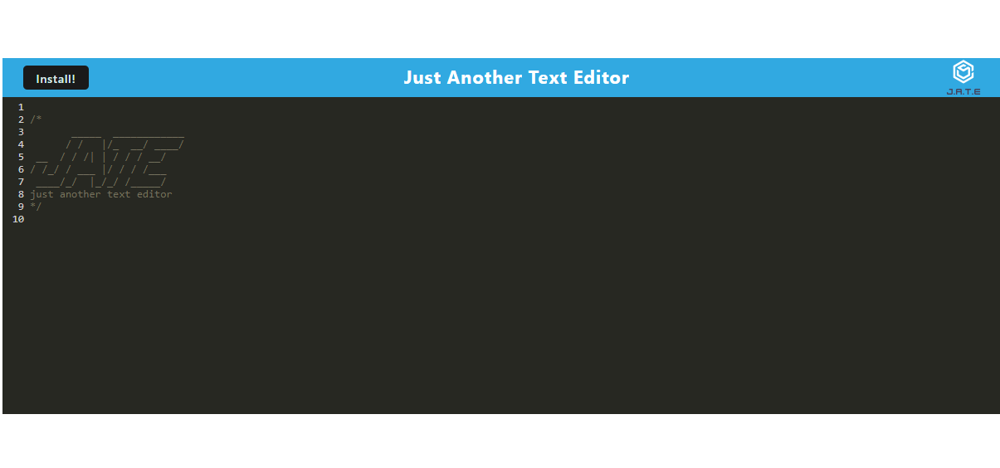

# JATE 

## Description
This is a text editor created as a PWA using webpack

## Table of Contents
- [Installation](#installation)
- [Usage](#usage)
- [License](#license)
- [Contributing](#contributing)
- [Tests](#tests)
- [Questions](#questions)

## Installation
To install, clone the repo, run npm i, then run npm run install, then you are all ready.

## Usage
To use run npm run start:dev and navigate to your localhost on port 3000

## License
[http://www.wtfpl.net/about/](http://www.wtfpl.net/about/)  
~~~
      DO WHAT THE FUCK YOU WANT TO PUBLIC LICENSE 
      Version 2, December 2004 

Copyright (C) 2004 Sam Hocevar <sam@hocevar.net> 

Everyone is permitted to copy and distribute verbatim or modified 
copies of this license document, and changing it is allowed as long 
as the name is changed. 

DO WHAT THE FUCK YOU WANT TO PUBLIC LICENSE 
TERMS AND CONDITIONS FOR COPYING, DISTRIBUTION AND MODIFICATION 

0. You just DO WHAT THE FUCK YOU WANT TO.
~~~

## Contributing
To contribute reach out to me on github or by email

## Tests
To test play around with adding text

## Questions
For any questions contact me on:  
Github: [https://github.com/MitchH10](github.com/MitchH10) or  
Email: [mjh10@live.com](mjh10@live.com)

## Link to repo
[https://github.com/MitchH10/JATE](https://github.com/MitchH10/JATE)